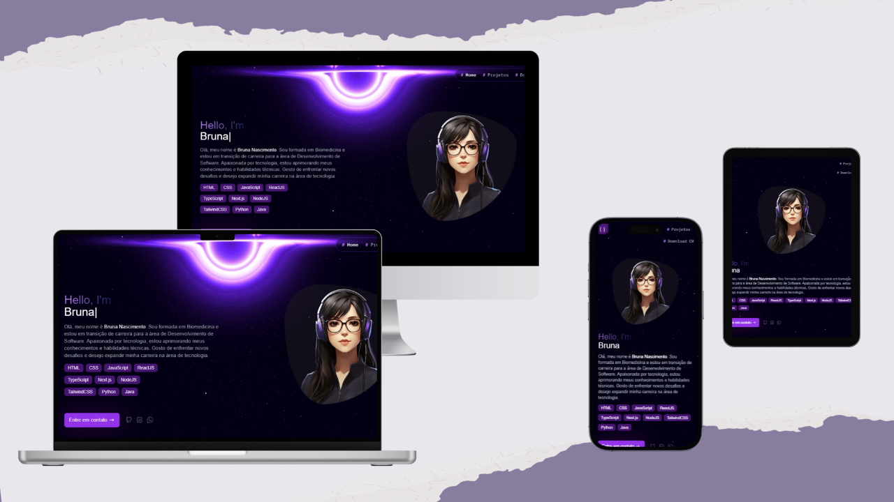

<h1 align="center">
    Portfólio - Bruna Nascimento
</h1>

  <a href="#-projeto">Projeto</a>&nbsp;&nbsp;&nbsp;|&nbsp;&nbsp;&nbsp;
  <a href="#-tecnologias">Tecnologias</a>&nbsp;&nbsp;&nbsp;

## 💻 Projeto

Bem-vindo ao meu portfólio! Aqui você encontrará uma seleção dos projetos que desenvolvi ao longo da minha jornada acadêmica e profissional. Sou estudante de Ciência da Computação com experiência em desenvolvimento web e interesse crescente na tecnologia.
 

  

## 🔧 Tecnologias

Esse projeto foi desenvolvido com as seguintes tecnologias:

- ReactJS
- NextJS
- TypeScript
- TailwindCSS
- Hygraph (CMS)
- Framer Motion
- Git e Github
- Vercel

## 🚀 Deploy
